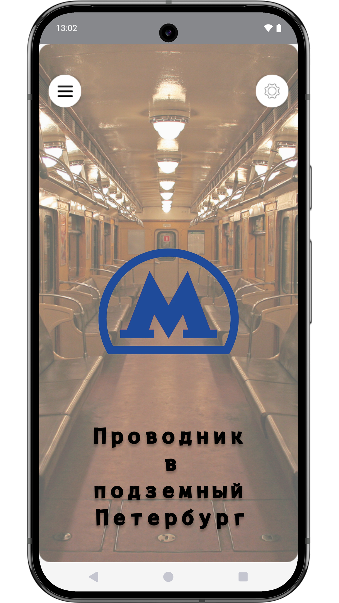
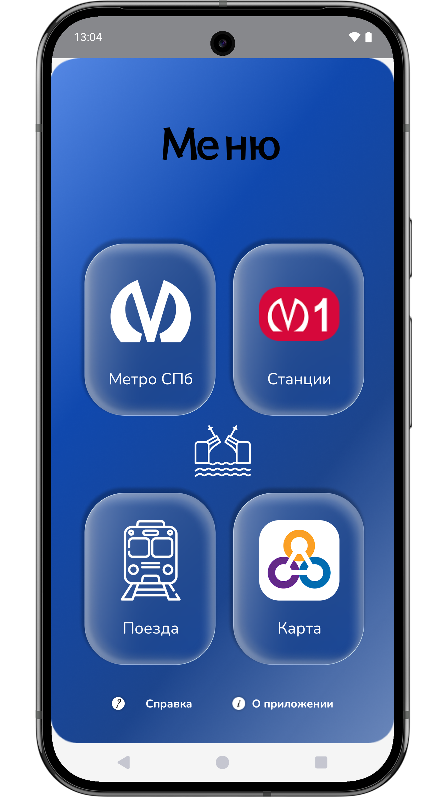
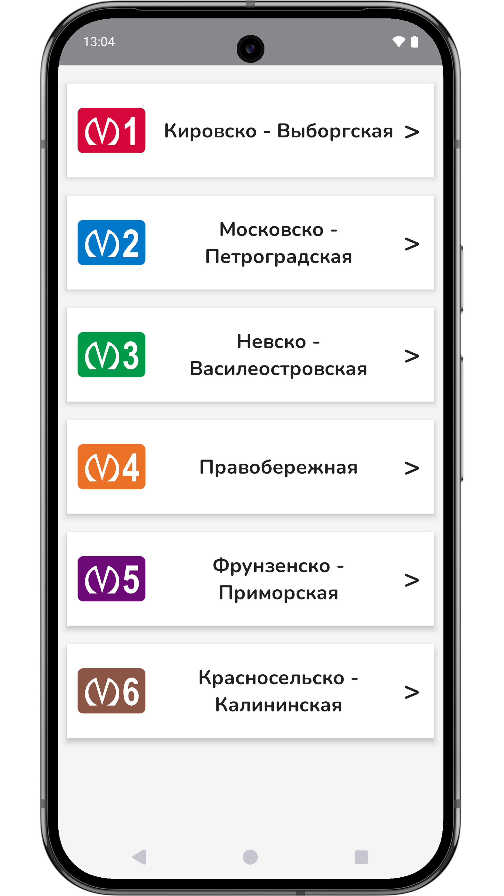
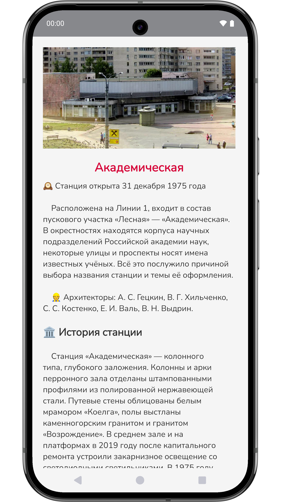
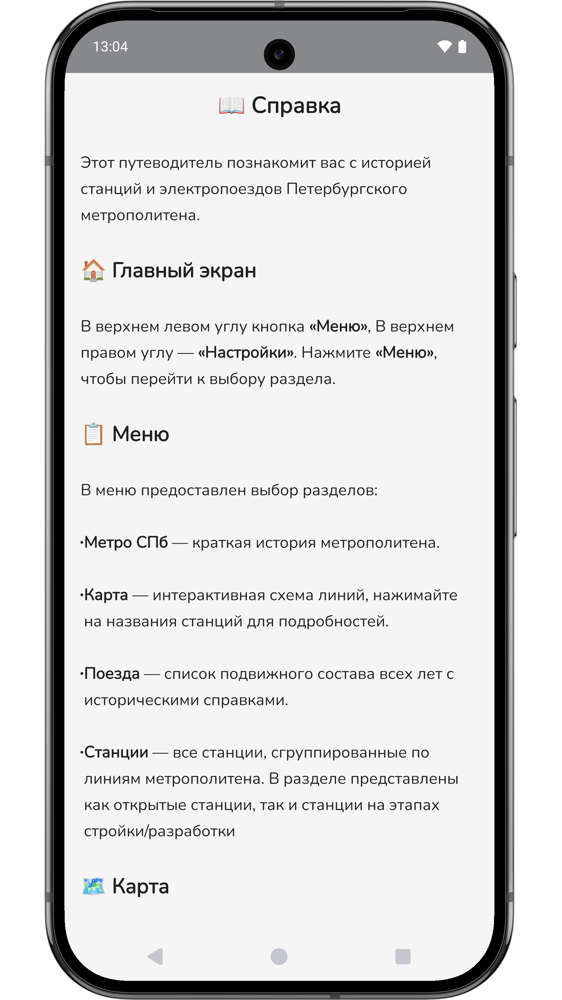
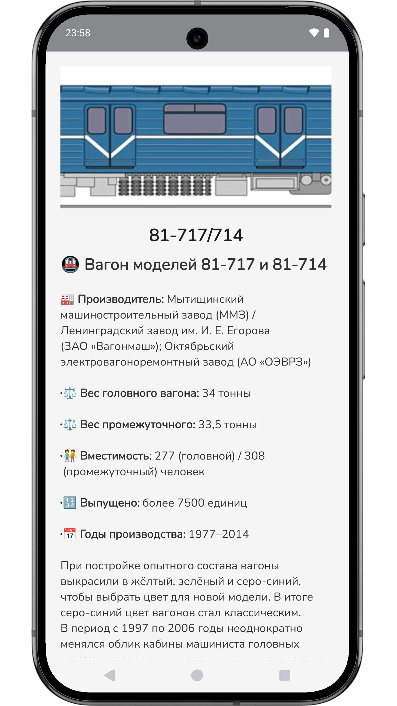
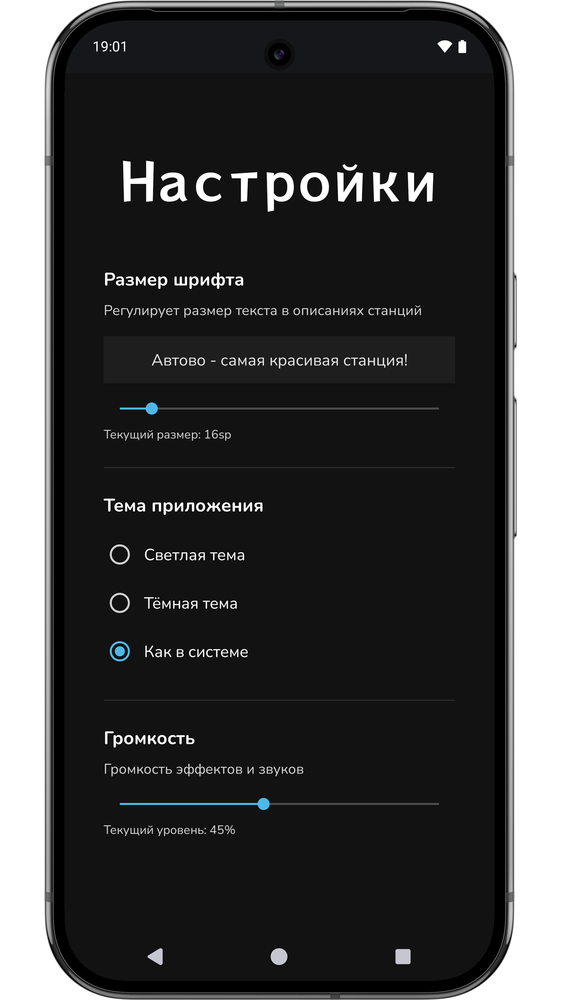

#🚇 Метро 2026 — справочник по истории метрополитена Петербурга

Приложение-энциклопедия для Android, которое рассказывает об истории станций и электропоездов Петербургского метро. Содержит интерактивную карту, подробные статьи с фотографиями, настраиваемый размер шрифта и тёмную тему.

- **🗺️ Интерактивная карта** — схема метро 2026 года.
- **🚉 Список станций** — все станции, сгруппированные по шести линиям.
- **🚃 Электропоезда** — хронология подвижного состава от первых вагонов типа «Г» до современного «Балтиец».
- **📖 Детальные статьи** — для каждой станции и поезда подготовлен исторический текст.
- **🎨 Тёмная тема** — ручное переключение, а также режим «как в системе».
- **📴 Полный офлайн** — все данные хранятся локально.

| Главный экран | Меню | Список станций | Детальная статья |
|---------------|------|----------------|------------------|
|  |  |  |  |

| Справка | Статья о поезде | Настройки |
|-----------|-----------------|-----------|
|  |  |  |

## 🚀 Запуск проекта

1. Склонируйте репозиторий:  
   `git clone https://github.com/barabashka-19/Metro2026`
2. Откройте папку в Android Studio.
3. Запустите на эмуляторе или устройстве (minSdk = 29).

## Ссылки

**RuStore** - rustore.ru/catalog/app/com.futo123.metro2026
**Telegram** - t.me/metro2026spb
**VK** - vk.com/metro2026spb
